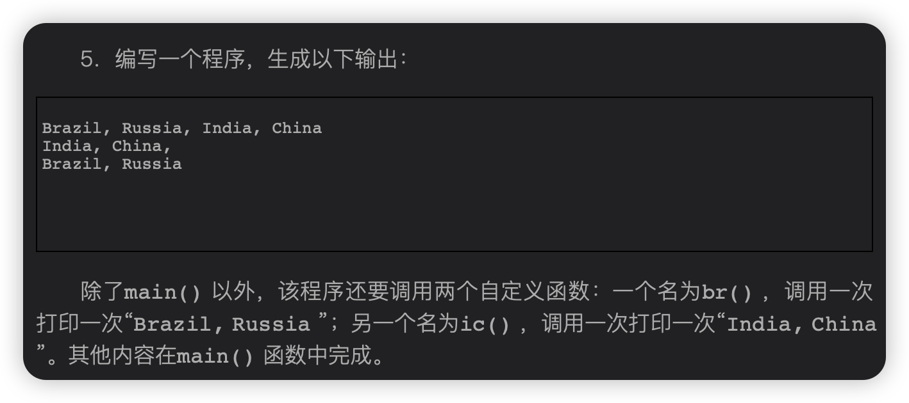

  
  

# 1.简单的print：
  
```c
#include <stdio.h>

int main(void){
    printf("Lemon Test\n");
    printf("Lemon\nTest\n");
    printf("Lemon ");
    printf("Test\n");
}
```
[点我跳转至源代码](1.c)

# 2.还是简单的print：
  
```c
#include <stdio.h>

int main(void){
    printf("Lemon Sun\n");
}
```
[点我跳转至源代码](2.c)

# 3.稍微复杂一点print和乘法：
  

```c
#include <stdio.h>

int main(void){
    int years=100;
    printf("你已经活了%d天，相当于这么多年：%d年\n",years * 365,years);
}
```
[点我跳转至源代码](3.c)

# 4.还是print：
  
```c
#include <stdio.h>

int jolly(void);
int deny(void);

int main(void){
    jolly();
    jolly();
    jolly();
    deny();
}

int jolly(void){
    printf("For he's a jolly good fellow!\n");
    return 0;
}

int deny(void){
    printf("Which nobody can deny!\n");
    return 0;
}
```
[点我跳转至源代码](4.c)

# 5.继续print：
  
```c
#include <stdio.h>
/*懒得打字所以用首字母代替*/
int br(void);
int ic(void);

int main(void){
    br();printf(",");ic();printf("\n");
    ic();printf(",\n");
    br();printf("\n");
}

int br(void){
    printf("B,R");
    return 0;
}

int ic(void){
    printf("I,C");
    return 0;
}
```
[点我跳转至源代码](5.c)
# 6.print加乘法
  

```c
#include <stdio.h>

int main(void){
    int toes = 10;
    printf("toes:%d toes*2:%d toes**2:%d\n",toes,toes * 2,toes*toes);
}
```
[点我跳转至源代码](6.c)

# 7.还是print：
  
```c
# include <stdio.h>

int smile(void);

int main(void){
    smile();smile();smile();printf("\n");
    smile();smile();printf("\n");
    smile();printf("\n");
}

int smile(void){
    printf("Smile!");
    return 0;
}

```
[点我跳转至源代码](7.c)

# 8.稍微复杂一点的函数调用print：
  
```c

```
[点我跳转至源代码](8.c)

