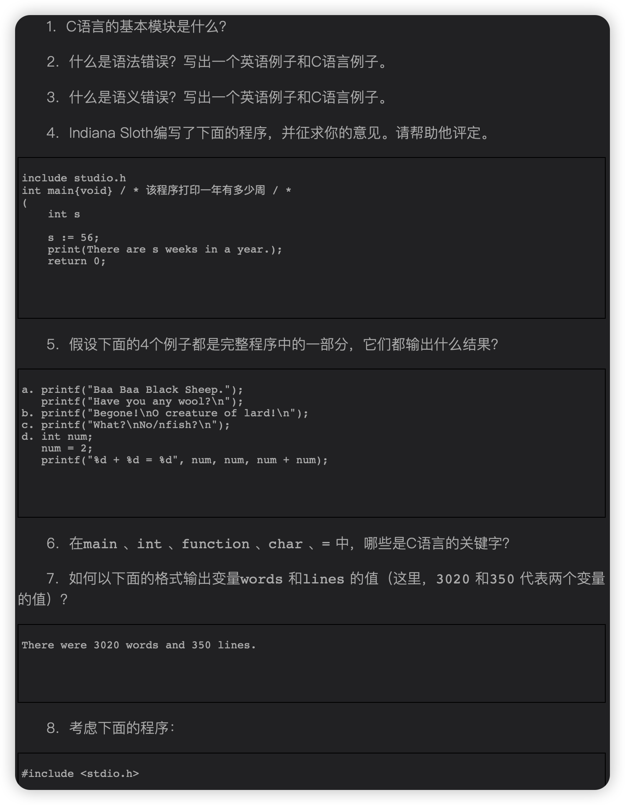
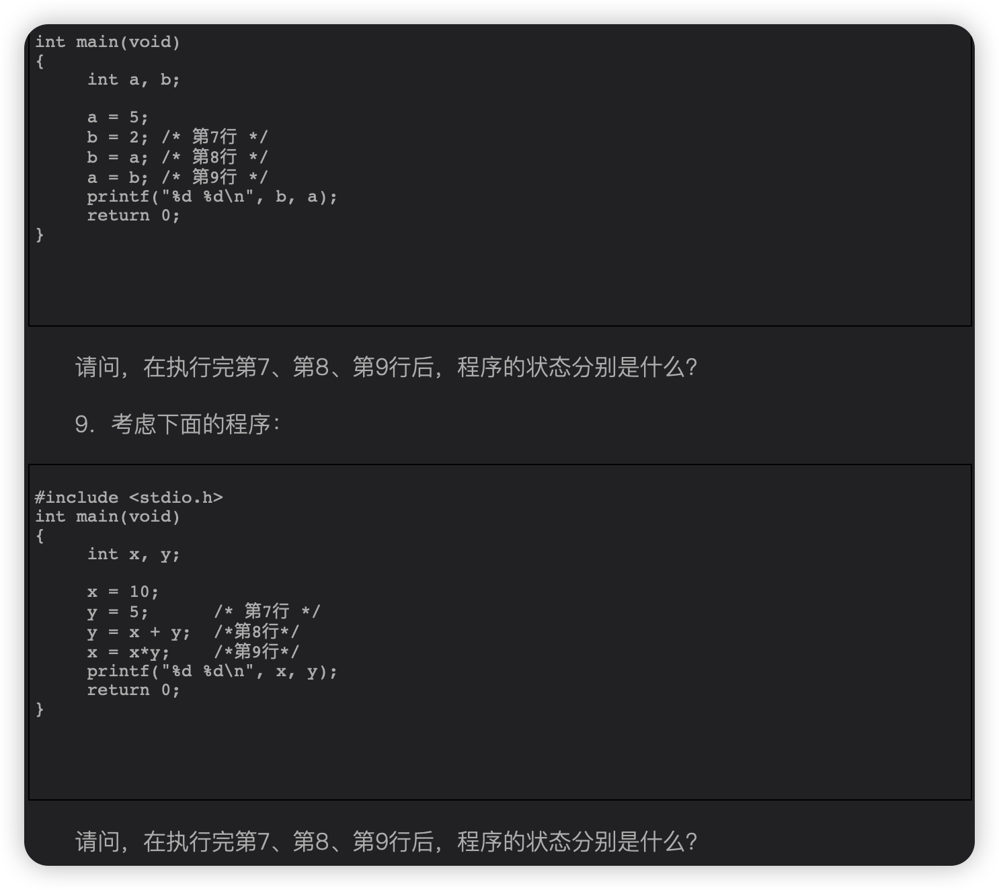
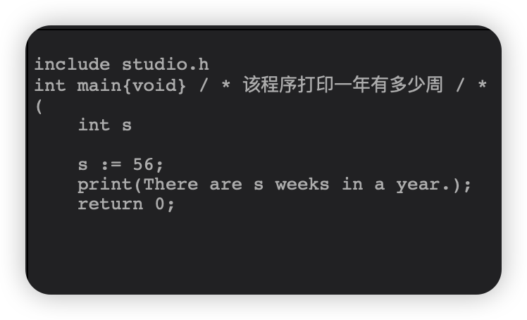
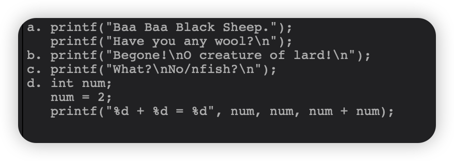
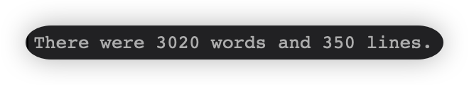
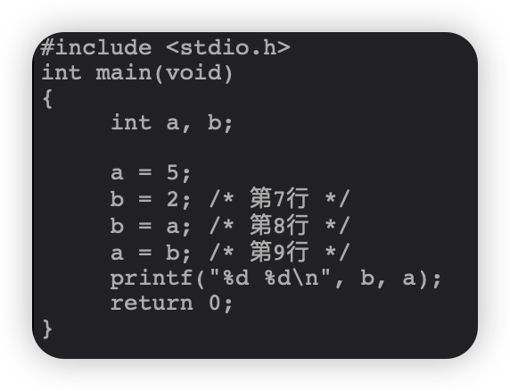
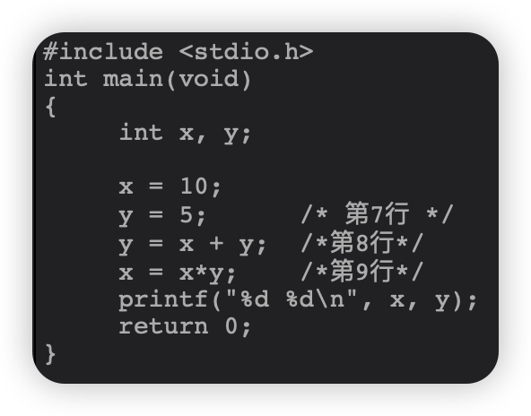

  
  

# 1.C语言的基本模块是什么？
函数

# 2.什么是语法错误？写出一个英语例子和C语言例子。
英语不好跳过
# 3.什么是语义错误？写出一个英语例子和C语言例子。
英语不好跳过
# 4.程序改错：
原程序：
  
正确程序：
```c
#include <stdio.h>
int main(void){
    int s;
    
    s = 52;
    printf("There are %d weeks in a year",s);
    return 0;
}
```
错误：
1. include前的 # 号，后面头文件不标准
2. 函数定义出错，大括号和小括号混用
3. ....

# 5.问下面程序输出什么：
  
1. `Baa Baa Black Sheep.Have you any wool?`
2. `Begone!`
`O creature of lard!`
3. `What?`
`No/nfish?`
4. `2 + 2 = 4`

# 6.在main、int、function、char、=中，哪些是C语言的关键字?
`int`,`char`

# 7.问怎么输出：
要求输出：
  
这样输出：
```c
printf("There were %d words and %d lines.\n",words,lines)
```
# 8.问程序执行状态：
程序：
  
问第7，8，9行执行过后分别是什么状态
1. b赋值为2
2. a的值5赋值至b上，故b为5
3. b的值再赋值至a上，故a为5

# 9.也是一个问程序执行状态的：
程序：
  
一样看第7，8，9行
1. y赋值为5
2. y赋值为x的值10和它自己的值5相加为15，也就是说y最后赋值为15
3. x赋值为它自己的值10和y的值15相乘为150

# 完.
跳转编程联系链接：[点我](../Programming%20exercise/main.md)